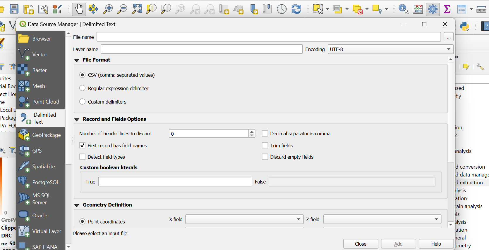
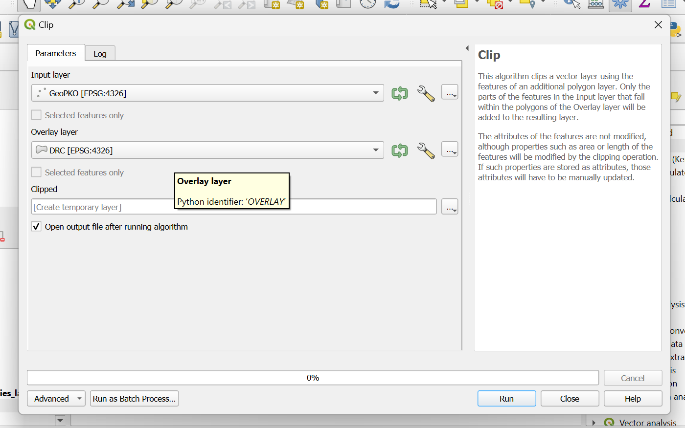

# Final Project -- John Gantner -- Peacekeeping and Violence in the Congo

#### Data information 

* This map was created with data provided by the Uppsala Conflict Data Program.

#### Why this map?

* This map was created to illustrate not only the dynamics of civilian violence in central africa, but the responses to it. In other words, I wanted to show whether or not United Nations Peacekeeping deployments were actually "following" or "flocking" to civilians in order to protect them once they were deployed in the conflict. The UN Mission in the Congo (MINUSCO) was one of the first modern peacekeeping operations beginning in 1998. So, I chose it as a sort of representative of how the other subsequent operations may act.

#### Map Creation Process

* The creation of this data project was fairly simple.

* First, I uploaded the georeferenced data into qgis

* Then, I essentially just utilized symbology and surface level analysis to create the map.

* I did utilize the clipping georeference tool to get all of my point data confined to the DRC. This tool is dsiplayed here:

## Index.html link

The final project is worth 400 points. The points are assigned as follows.

### Projection Information

* All the point data was brought in using EPSG 4326 -- The Generic Mercator Projection. This was utilized for the entirety of the project.